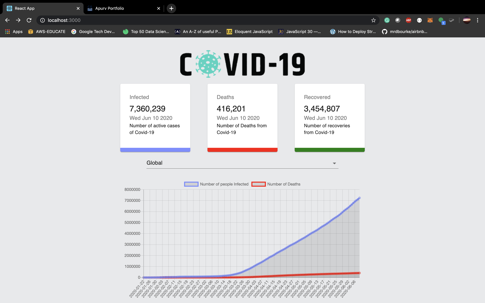
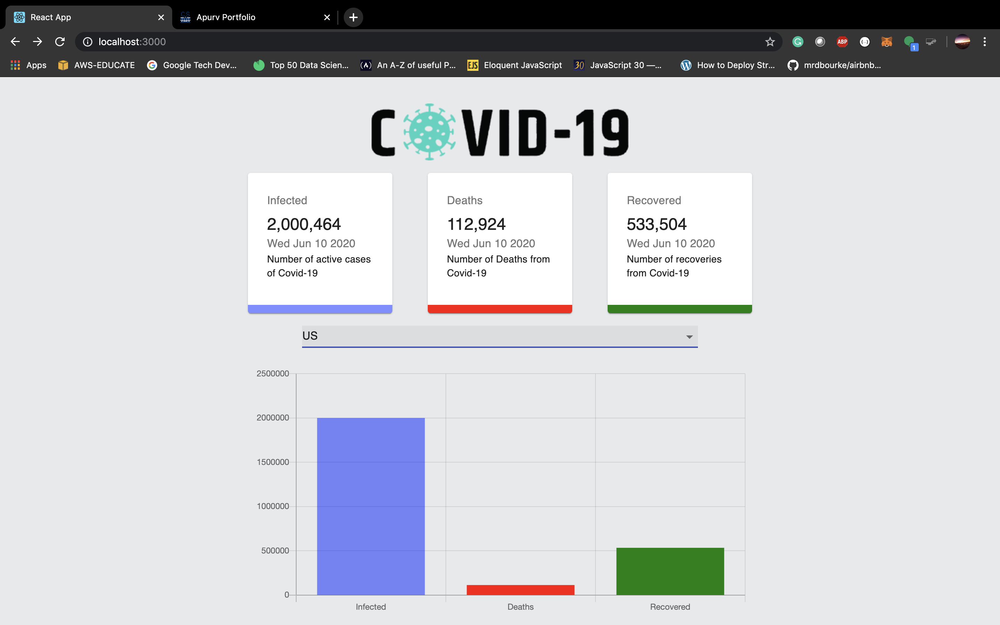

# Covid-19 Cases Tracker

This [React based covid19 stats](https://covid-19-74e56.web.app/) web application using
[Odi aka mathdroid covid19 API](https://github.com/mathdroid)

## Usage

1. Clone

   ```bash
   git clone https://github.com/apurva-modi/coronacase-tracker.git
   ```

2. Install deps (`yarn`, `npm install`)

3. To run it on localhost.

   ```bash
   npm start
   ```

## React Components

- Cards (for demonstrating Infected, Recoverd and Deaths stats)
  - Uses Card, CardContent, Typography and Grid from Material-UI
- CountryPicker (for selecting countries)
  - uses react's useEffect and useState to fetch countries from the API.
- Charts (based on selected country shows the country's Covid19 stats)
  - Uses react's useEffect and useState to set Daily data to Line and Bar chart based on fetched countries.

Credit: @JavaScript Mastery

# Global Cases



# Country Stats


